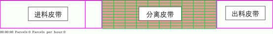
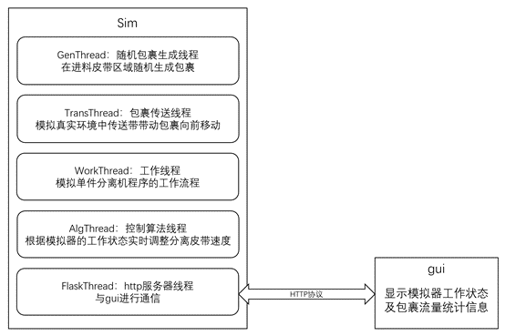

# 使用说明
## 1. 文件目录
Simulator：软件运行根目录  
Alg.py：控制算法  
config_*.yml：配置文件  
Configuration.py：配置类  
DEMO.mp4：仿真软件运行状态演示视频  
gui.py：GUI程序  
info.py：仿真软件运行状态信息类  
InfoLock.py：数据同步锁  
JudgeOverlap.py：包裹碰撞检测模块  
JudgeRunOver.py：包裹穿越检测模块  
main.py：主函数，仿真软件启动入口  
Parcel.py：包裹类  
RandomParcelsGenerator：随机包裹生成模块  
requirements.txt：软件依赖环境  
RotatedRectangle.py：旋转矩形类  
Sim.py：仿真软件主类  
Singleton.py：单例函数

## 2. 仿真软件
### 1. 软件框架  
  
皮带布局示意图  
  
软件框架示意图

### 2. 软件环境  
    1. Python 3.8 + pip3  
    2. 控制台进入仿真软件代码根目录，运行如下指令安装python依赖库：  
> pip3 install -r requirements.txt

### 3. 启动模拟器  
配置好main.py中yml_path的路径后，运行main.py即可启动模拟器。config_default为用于演示仿真软件功能的配置文件，参赛选手需要设计控制算法尽可能满足在config_6x8，config_7x10，config_9x10这三种不同配置环境下的包裹分离需求。

### 4. GUI程序  
启动模拟器程序后运行gui.py即可查看模拟器的工作状态和包裹流量统计信息。  
在gui界面，按下’s’键可以保存模拟器运行视频并退出gui程序，按下’q’键可以保存模拟器运行画面并退出gui程序和模拟器程序。

### 5. 命令行启动
* windows系统  
命令提示符下运行
> start_scripts_win.bat [配置文件路径]

* linux系统  
bash下运行
> ./start_script_linux.sh [配置文件路径]

### 6. 控制算法
控制算法在*Alg.py*的*alg*函数中实现，重写该函数即可
> def alg(parcels, cur_speeds, config) -> list  
* parcels: 当前处于分离皮带上的包裹列表[parcel0,parcel1,parcel2, ... ]，parceln为Parcel类，包含的包裹状态信息参看Parcel类
* cur_speeds: list，当前分离皮带的运行速度列表[s00, s01, s02,...]，顺序：先沿皮带前进方向从左到右，再沿垂直于皮带前进方向从上到下
* config: SeparateConfig类，仿真软件的配置信息
* *return*: 分离皮带预期速度列表[s00, s01, s02,...]，顺序：先沿皮带前进方向从左到右，再沿垂直于皮带前进方向从上到下

### 7. 错误状态说明
    1. 出双doubleout：任意时刻有超过一个以上的包裹的旋转矩形框横跨分离皮带与出料皮带的交界处。
    2. 碰撞overlap、穿越runover：任意时刻任意两个包裹的旋转矩形框出现重叠。
    3. 输出间距过小：在分离程序运行过程中，前一个包裹完全离开分离皮带（包裹完全进入出料皮带）的时刻为t1，后一个包裹开始离开分离皮带（包裹开始进入出料皮带）的时刻为t2，两者的时间差Δt=t2-t1，Δt必须大于配置文件设定好的阈值，也即先后离开分离皮带的包裹之间应在x方向有一定的间距。
